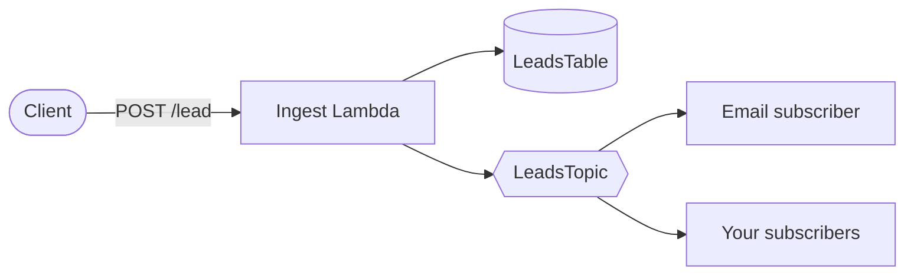

# aws-serverless-lead-capture

A reusable AWS SAM pattern for a serverless form-ingest pipeline: HTTP API →
Lambda → DynamoDB (storage) + SNS (fan-out notification) — with idempotency
built in, not bolted on. Extracted and generalized from a production lead
capture form.



See [docs/ARCHITECTURE.md](docs/ARCHITECTURE.md) for the full request-flow
sequence diagram (including the idempotency branches) and design rationale.

## Idempotency

Duplicate form submissions — double-clicks, mobile-client retries after a
dropped connection, an aggressive-retry frontend — should not fan out twice.
This pattern solves that at the ingest layer:

- The Lambda expects an `Idempotency-Key` header. Any stable string works: a
  UUID generated per submission attempt, a form-session ID, a hash the
  caller already computed.
- If the header is absent, the Lambda falls back to a SHA256 hash of the
  request body, so callers that don't send the header still get
  exact-duplicate protection.
- The key is reserved in DynamoDB with a conditional write
  (`ConditionExpression: attribute_not_exists(idempotency_key)`) **before**
  the lead is stored or the SNS notification is published — this is what
  closes the race window for two near-simultaneous duplicate requests, not
  just sequential retries.
- On a duplicate: the Lambda returns `200` with the original response
  (idempotent retry contract — same request, same result, no second
  fan-out) instead of erroring.
- Idempotency records TTL out of DynamoDB after 24 hours (configurable), so
  there's no cleanup job to run or table to prune.

Full write-up — including why the reservation happens *before* processing
rather than after, what happens for genuinely concurrent duplicates, and why
this doesn't use SNS FIFO message-deduplication IDs — is in
[docs/ARCHITECTURE.md](docs/ARCHITECTURE.md#idempotency-design).

## Prerequisites

- An AWS account, and the AWS SAM CLI installed
  (`sam --version`; see [AWS's install docs](https://docs.aws.amazon.com/serverless-application-model/latest/developerguide/install-sam-cli.html)).
- AWS credentials configured (`aws configure`, or the equivalent
  `AWS_ACCESS_KEY_ID` / `AWS_SECRET_ACCESS_KEY` environment variables).
- IAM permissions to create the resources this template deploys (Lambda,
  DynamoDB, API Gateway, SNS, and an execution role) — see AWS's
  [SAM deployment permissions guidance](https://docs.aws.amazon.com/serverless-application-model/latest/developerguide/serverless-getting-started-permissions.html)
  if deploying under a restricted IAM policy.
- Python 3.12 (matches the Lambda runtime).
- To run the test suite locally (no AWS account needed for this part):
  `pip install -r requirements-dev.txt`. See [Testing](#testing).

## Client integration

Minimal example: a form that POSTs to the deployed endpoint with a fresh
idempotency key per submission attempt.

```html
<form id="lead-form">
  <input name="name" placeholder="Name" required />
  <input name="email" type="email" placeholder="Email" required />
  <input name="utm_source" type="hidden" value="landing-page" />
  <button type="submit">Submit</button>
</form>

<script>
document.getElementById("lead-form").addEventListener("submit", async (e) => {
  e.preventDefault();
  const data = Object.fromEntries(new FormData(e.target));

  try {
    const res = await fetch("https://YOUR_API_ID.execute-api.YOUR_REGION.amazonaws.com/lead", {
      method: "POST",
      headers: {
        "Content-Type": "application/json",
        "Idempotency-Key": crypto.randomUUID(),
      },
      body: JSON.stringify(data),
    });
    if (!res.ok) throw new Error(`Request failed: ${res.status}`);
    console.log("Lead submitted:", await res.json());
  } catch (err) {
    console.error("Submission failed:", err);
  }
});
</script>
```

`name` and `email` are the fields `lambda_function.py` reads directly;
`utm_source` shows that extra fields pass through the request body without
error, for whatever you extend the handler to do with them later. Call
`crypto.randomUUID()` once per submission *attempt*, not once per page load —
that's what lets a genuine resubmission (user edits the form and submits
again) go through instead of being deduplicated against the first attempt.

Before deploying to production, set `CorsConfiguration.AllowOrigins` in
`template.yaml` to your frontend's origin instead of `['*']`.

## Deploy

Deployable in any AWS region — there's no CloudFront/ACM region constraint
here.

```bash
sam build
sam deploy --guided
```

`--guided` will prompt for:

| Parameter | Example |
|---|---|
| `NotificationEmail` | `you@example.com` |
| `IdempotencyTtlHours` | `24` |

Answers are saved to `samconfig.toml` (gitignored — see
`samconfig.toml.example` for the format if you'd rather write it by hand and
skip `--guided` on subsequent deploys).

After deploy, **confirm the SNS email subscription** — check
`NotificationEmail`'s inbox for a "AWS Notification - Subscription
Confirmation" email and click the link. CloudFormation can create the
subscription but can't auto-confirm it.

## Verifying idempotency

`verify_idempotency.py` posts the same payload with the same
`Idempotency-Key` twice against a deployed stack and asserts:

- Both responses are `200` with an identical body.
- Exactly one item lands in `LeadsTable`.

```bash
python3 verify_idempotency.py --stack-name aws-serverless-lead-capture
```

It reads the API endpoint and table name from the stack's CloudFormation
outputs, so it only needs the stack name (defaults to
`aws-serverless-lead-capture`) and your normal AWS credentials/region.

## Testing

Unit and end-to-end tests run against a [moto](https://github.com/getmoto/moto)-mocked
DynamoDB and SNS — no AWS credentials or deployed stack required.

```bash
pip install -r requirements-dev.txt
pytest tests/ -v
```

Expected: 14 tests passing.

## Extending

- **Scoring logic**: `src/ingest/scorer.py` is a worked example (rule-based
  heuristic), not part of the idempotency pattern. Replace `score_lead()`
  with your own logic or a model invocation — the `{score, tier, factors}`
  output contract is all `lambda_function.py` depends on.
- **Storage**: swap `LeadsTable`'s single-table design in `template.yaml`
  for whatever schema your use case needs; the idempotency layer doesn't
  care what happens between "reserve" and "complete".

## License

MIT — see [LICENSE](LICENSE).
