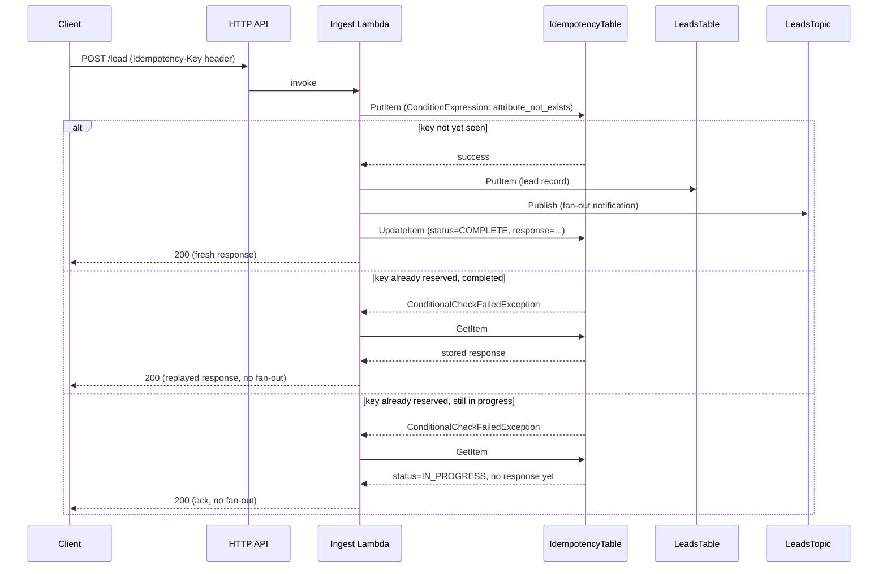

# Architecture

## Request flow

## Idempotency design

The problem: a naive ingest Lambda writes to DynamoDB and publishes to SNS
unconditionally on every invocation. A double-click, a mobile client retrying
after a flaky connection, or a frontend with aggressive retry logic all
produce duplicate side effects - duplicate lead records, duplicate
notification emails. This repo's `src/ingest/idempotency.py` and its
integration in `lambda_function.py` are the fix, not a documented caveat.

### Client-supplied key, with a fallback

The Lambda expects an `Idempotency-Key` header. Any stable string works - a
UUID generated per form-submission attempt, a form-session ID, a hash the
caller already computed. This is the same contract used by Stripe's API and
by AWS's own APIs that support idempotency tokens; callers integrating with
this pattern will likely already recognize it.

If the header is absent, `resolve_key()` falls back to `sha256(raw body)`.
This means callers that haven't been updated to send the header still get
protection against exact-duplicate resubmission (same fields, same values) -
just not against a legitimate resubmission of *different* content under the
same logical operation, which only a real idempotency key can express.

### Reserve before you act, not after

The conditional `PutItem` (`ConditionExpression: attribute_not_exists(idempotency_key)`)
happens **before** the lead is written to DynamoDB or the SNS notification is
published - not after. This ordering is what actually closes the race
window:

- If the reservation happened *after* processing, two requests arriving
  within milliseconds of each other (a genuine double-click, not a
  sequential retry) would both pass through scoring, both write a lead
  record, and both publish to SNS - only the *second* reservation write
  would fail, by which point the damage is already done.
- Reserving first means DynamoDB's atomic conditional write is the single
  point of truth: of two concurrent `PutItem` calls for the same key,
  exactly one succeeds. The loser never reaches the SNS publish at all.

The tradeoff this creates: a request that reserves the key and then crashes
or times out mid-processing leaves the record `IN_PROGRESS` until the TTL
expires it. A subsequent retry with the same key gets a 200 ack (no
re-processing) rather than a completed response, since there's nothing to
replay yet. This repo treats that as an acceptable, documented edge case
rather than adding polling/blocking to wait out an in-flight request -
the caller's own retry-with-backoff will eventually hit the TTL expiry and
get a fresh attempt if the original truly died.

### TTL, not a cleanup job

Idempotency records set `expires_at` (epoch seconds, `IdempotencyTtlHours`
parameter, default 24h) and the DynamoDB table has
`TimeToLiveSpecification` enabled on that attribute. DynamoDB deletes
expired items in the background at no operational cost - no scheduled
Lambda, no manual purge script, no growing table.

### Why not SNS FIFO message deduplication IDs

SNS FIFO topics support a `MessageDeduplicationId` that would deduplicate
messages automatically. It's not used here for two reasons:

1. **Window is too short.** FIFO dedup only covers a 5-minute window,
   applied per-topic. A retry that arrives 10 minutes later (a real
   scenario for a mobile client that lost connectivity) would not be
   deduplicated.
2. **FIFO topics don't fit fan-out.** FIFO topics have throughput limits and
   ordering guarantees that standard topics don't need and that most
   fan-out notification use cases don't want. This pattern intentionally
   uses a standard SNS topic, so FIFO dedup isn't available regardless.

Deduplicating at the DynamoDB layer, ahead of the SNS publish, works
identically regardless of topic type and gives an explicit, tunable TTL
instead of a fixed 5-minute window.
